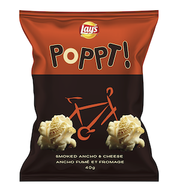
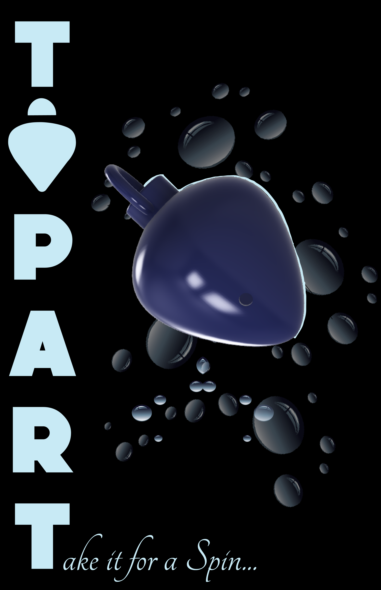

  

  	

	  <a href='projects/QuestioningKit/' class='c-post-card c-post-card--first'>
	    <h3 class='c-post-card__title'>Questioning Kit</h3>
	    

	    

	      Tactile tool for playfully practicing questioning skills.
	    

	  </a>
   

  	

	  <a href='projects/PlayBooklets/' class='c-post-card'>
	    <h3 class='c-post-card__title'>Play Booklets</h3>
	    

	    

	      Booklet that provides context for practice through play.
	    

	  </a>
   

  	

	  <a href='projects/PackageDesign/Popcorn/' class='c-post-card'>
	    <h3 class='c-post-card__title'>Packaging: Popcorn</h3>
	    

	    

	      Package design for Popcorn.
	    

	  </a>
   

 	

	  <a href='projects/PackageDesign/Tequila/' class='c-post-card'>
	    <h3 class='c-post-card__title'>Packaging: Tequila</h3>
	    

	    

	      Package design for Tequila.
	    

	  </a>
   

 	

	  <a href='projects/ToyDesign/' class='c-post-card c-post-card--last'>
	    <h3 class='c-post-card__title'>Toy Design</h3>
	    

	    

	      Toy that combines science, art and play.
	    

	  </a>
   

  
  

