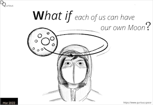

	

    	
	

	

		<h2>What was this project about?</h2>
		
The intent was to create a play book (Practice through Play) that one engages through play all the while practicing essential skills. 

		<h2>What did I realize?</h2>
		<ul>
			<li>Designing experience that encourages play and leads to learning is challenging.</li>
			<li>Play testing the creations was fun and led to lots of insights.</li>
			<li>Feedback from families and children was encouraging that this series has potential.</li>
		</ul>
	

## Feedback
* _Founder_:  I see you as hard working and open to feedback. You worked with me to determine the what I had in mind and helped me articulate it better. The final design was to my satisfaction.
* _Parent_: The series was vey interesting way to introduce my children to different concepts. My children enjoyed the series and learnt a lot through the process.

## What did I do?

From the brief I worked on creating different booklet series - What if?, Frame, Connect, that adapted world building and association techniques for kids to break the current paradigm and explore. I started with understanding the brief, who my client is, who is it for, the age range and what is the topic. After understanding the topic I broke down into different parts - the core components and how it can be simplified. Then I focused on designing the experience - how they get to know, how they get started, the core message, key reflections and realizations. I designed the guide through the journey.

